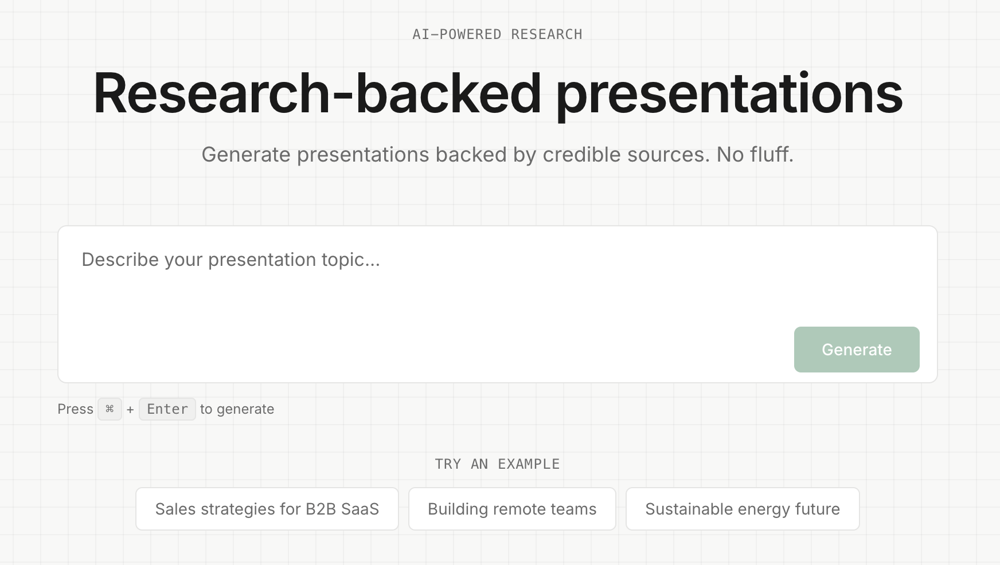

# Dossier AI

> Research-backed AI presentation generator that creates professional slides with cited content in under 5 minutes.



## Features

- **Intelligent Research** - Web search with reputable source prioritization
- **Smart Outline Generation** - AI-powered outlines with real-time streaming
- **Full Presentation Generation** - Multiple citation styles, beautiful themes
- **Interactive Editing** - Drag-and-drop, inline editing, auto-save
- **PDF Export** - High-quality PDF export for sharing

## Tech Stack

| Category | Technology |
|----------|------------|
| Framework | Next.js 15 (App Router) |
| AI | Vercel AI SDK + Anthropic Claude |
| Search | Brave Search API |
| Database | Supabase (PostgreSQL) |
| Auth | Supabase Auth (Google OAuth) |
| UI | Tailwind CSS, shadcn/ui, Framer Motion |
| State | Zustand |

## Quick Start

### Prerequisites

- Node.js >= 18.0.0
- Supabase account ([supabase.com](https://supabase.com))
- Anthropic API key ([console.anthropic.com](https://console.anthropic.com))
- Brave Search API key (optional, for research mode)

### Setup

1. **Clone and install:**
   ```bash
   git clone https://github.com/yourusername/dossier.git
   cd dossier/frontend
   npm install
   ```

2. **Configure environment:**
   ```bash
   cp .env.example .env.local
   ```
   Edit `.env.local` with your API keys.

3. **Set up Supabase:**
   - Create a project at [supabase.com](https://supabase.com)
   - Run migrations from `supabase/migrations/` in order
   - Enable Google OAuth in Authentication settings

4. **Run development server:**
   ```bash
   npm run dev
   ```

5. **Open** http://localhost:3000

### Docker (Optional)

```bash
docker compose up
```

## Project Structure

```
dossier/
├── frontend/              # Next.js full-stack application
│   ├── app/              # Pages + API routes
│   │   ├── api/          # Backend API endpoints
│   │   ├── dashboard/    # User dashboard
│   │   └── presentation/ # Presentation viewer/editor
│   ├── components/       # React components
│   ├── lib/              # Utilities, agents, services
│   └── store/            # Zustand state stores
├── supabase/             # Database migrations
├── architecture.md       # System architecture docs
└── CONTRIBUTING.md       # Contribution guidelines
```

## Environment Variables

| Variable | Required | Description |
|----------|----------|-------------|
| `NEXT_PUBLIC_SUPABASE_URL` | Yes | Supabase project URL |
| `NEXT_PUBLIC_SUPABASE_ANON_KEY` | Yes | Supabase anonymous key |
| `SUPABASE_SERVICE_ROLE_KEY` | Yes | Supabase service role key |
| `ANTHROPIC_API_KEY` | Yes | Anthropic API key for Claude |
| `BRAVE_SEARCH_API_KEY` | No | Brave Search API (enables research mode) |
| `NEXT_PUBLIC_APP_URL` | No | App URL for metadata |

## Documentation

- [Architecture](architecture.md) - System design and data flow
- [Contributing](CONTRIBUTING.md) - Contribution guidelines

## License

[AGPL-3.0](LICENSE) - See LICENSE file for details.

## Acknowledgments

Built with [Next.js](https://nextjs.org/) | Powered by [Anthropic Claude](https://anthropic.com/) | Database by [Supabase](https://supabase.com/) | UI from [shadcn/ui](https://ui.shadcn.com/)
